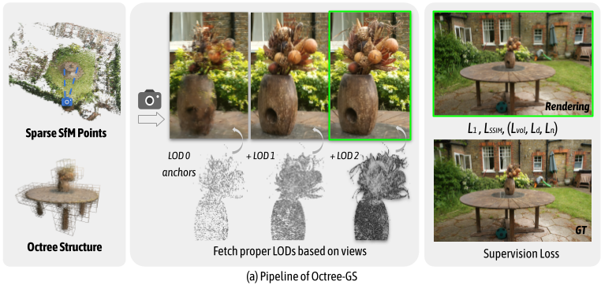
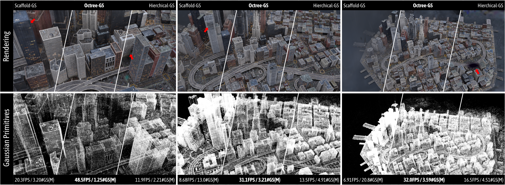

# *Octree*-GS: Towards Consistent Real-time Rendering with LOD-Structured 3D Gaussians

### [Project Page](https://city-super.github.io/octree-gs/) | [Paper](https://arxiv.org/abs/2403.17898)

[Kerui Ren*](https://github.com/tongji-rkr), [Lihan Jiang*](https://jianglh-whu.github.io/), [Tao Lu](https://github.com/inspirelt), [Mulin Yu](https://scholar.google.com/citations?user=w0Od3hQAAAAJ), [Linning Xu](https://eveneveno.github.io/lnxu), [Zhangkai Ni](https://eezkni.github.io/), [Bo Dai](https://daibo.info/) ✉️ <br />

## News
**[2024.09.25]** 🎈We propose **Octree-AnyGS**, a general anchor-based framework that supports explicit Gaussians (2D-GS, 3D-GS) and neural Gaussians (Scaffold-GS). Additionally, **Octree-GS** has been adapted to the aforementioned Gaussian primitives, enabling Level-of-Detail representation for large-scale scenes. This framework holds potential for application to other Gaussian-based methods, with relevant SIBR visualizations forthcoming.

## Overview

<p align="center">

</p>

  Abstract: The recently proposed 3D Gaussian Splatting (3D-GS) demonstrates superior rendering fidelity and efficiency compared to NeRF-based scene representations. However, it struggles in large-scale scenes due to the high number of Gaussian primitives, particularly in zoomed-out views, where all primitives are rendered regardless of their projected size. This often results in inefficient use of model capacity and difficulty capturing details at varying scales. To address this, we introduce Octree-GS, a Level-of-Detail (LOD) structured approach that dynamically selects appropriate levels from a set of multi-scale Gaussian primitives, ensuring consistent rendering performance. To adapt the design of LOD, we employ an innovative grow-and-prune strategy for densification and also propose a progressive training strategy to arrange Gaussians into appropriate LOD levels. Additionally, our LOD strategy generalizes to other Gaussian-based methods, such as 2D-GS and Scaffold-GS, reducing the number of primitives needed for rendering while maintaining scene reconstruction accuracy. Experiments on diverse datasets demonstrate that our method achieves real-time speeds, with even 10 × faster than state-of-the-art methods in large-scale scenes, without compromising visual quality.

<p align="center">

</p>

## Installation

We tested on a server configured with Ubuntu 20.04, cuda 11.8 and gcc 9.4.0. Other similar configurations should also work, but we have not verified each one individually.

1. Clone this repo:

```
git clone https://github.com/city-super/Octree-AnyGS.git --recursive
cd Octree-GS
```

2. Install dependencies

```
SET DISTUTILS_USE_SDK=1 # Windows only
conda env create --file environment.yml
conda activate octree_gs
```

## Data

First, create a ```data/``` folder inside the project path by 

```
mkdir data
```

The data structure will be organised as follows:

```
data/
├── dataset_name
│   ├── scene1/
│   │   ├── images
│   │   │   ├── IMG_0.jpg
│   │   │   ├── IMG_1.jpg
│   │   │   ├── ...
│   │   ├── sparse/
│   │       └──0/
│   ├── scene2/
│   │   ├── images
│   │   │   ├── IMG_0.jpg
│   │   │   ├── IMG_1.jpg
│   │   │   ├── ...
│   │   ├── sparse/
│   │       └──0/
...
```

### Public Data

- The MipNeRF360 scenes are provided by the paper author [here](https://jonbarron.info/mipnerf360/). 
- The SfM data sets for Tanks&Temples and Deep Blending are hosted by 3D-Gaussian-Splatting [here](https://repo-sam.inria.fr/fungraph/3d-gaussian-splatting/datasets/input/tandt_db.zip).
- The BungeeNeRF dataset is available in [Google Drive](https://drive.google.com/file/d/1nBLcf9Jrr6sdxKa1Hbd47IArQQ_X8lww/view?usp=sharing)/[百度网盘[提取码:4whv]](https://pan.baidu.com/s/1AUYUJojhhICSKO2JrmOnCA). 
- The MatrixCity dataset can be downloaded from [Hugging Face](https://huggingface.co/datasets/BoDai/MatrixCity/tree/main)/[Openxlab](https://openxlab.org.cn/datasets/bdaibdai/MatrixCity)/[百度网盘[提取码:hqnn]](https://pan.baidu.com/share/init?surl=87P0e5p1hz9t5mgdJXjL1g). Point clouds used for training in our paper: [pcd](https://drive.google.com/file/d/1J5sGnKhtOdXpGY0SVt-2D_VmL5qdrIc5/view?usp=sharing)
Download and uncompress them into the ```data/``` folder.

### Custom Data

For custom data, you should process the image sequences with [Colmap](https://colmap.github.io/) to obtain the SfM points and camera poses. Then, place the results into ```data/``` folder.


## Training

For training a single scene with the base model, modify the path and configurations in ```config/<method>/base_model.yaml``` accordingly and run it:

```
python train.py --config config/<method>/base_model.yaml
```

For training  a single scene with the lod model, modify the path and configurations in ```config/<method>/lod_model.yaml``` accordingly and run it:

```
python train.py --config config/<method>/lod_model.yaml
```

This command will store the configuration file and log (with running-time code) into ```outputs/dataset_name/scene_name/cur_time``` automatically.

In addition, we use [gsplat](https://docs.gsplat.studio/main/) to unify the rendering process of different Gaussians. Considering the adaptation for 2D-GS, we choose [gsplat version](https://github.com/FantasticOven2/gsplat.git) which supports 2DGS.

## Evaluation

We keep the manual rendering function with a similar usage of the counterpart in [3D-GS](https://github.com/graphdeco-inria/gaussian-splatting), one can run it by 

```
python render.py -m <path to trained model> # Generate renderings
python metrics.py -m <path to trained model> # Compute error metrics on renderings
```

## Viewer

The SIBR viewers is coming soon.

## Contact

- Kerui Ren: renkerui@pjlab.org.cn
- Lihan Jiang: mr.lhjiang@gmail.com

## Citation

If you find our work helpful, please consider citing:

```bibtex
@article{ren2024octree,
  title={Octree-gs: Towards consistent real-time rendering with lod-structured 3d gaussians},
  author={Ren, Kerui and Jiang, Lihan and Lu, Tao and Yu, Mulin and Xu, Linning and Ni, Zhangkai and Dai, Bo},
  journal={arXiv preprint arXiv:2403.17898},
  year={2024}
}
```

## LICENSE

Please follow the LICENSE of [3D-GS](https://github.com/graphdeco-inria/gaussian-splatting).

## Acknowledgement

We thank all authors from [2D-GS](https://github.com/hbb1/2d-gaussian-splatting), [3D-GS](https://github.com/graphdeco-inria/gaussian-splatting) and [Scaffold-GS](https://github.com/city-super/Scaffold-GS) for presenting such an excellent work. We also thank all authors from [gsplat](https://github.com/nerfstudio-project/gsplat) for presenting a generic and efficient Gaussian splatting framework.
